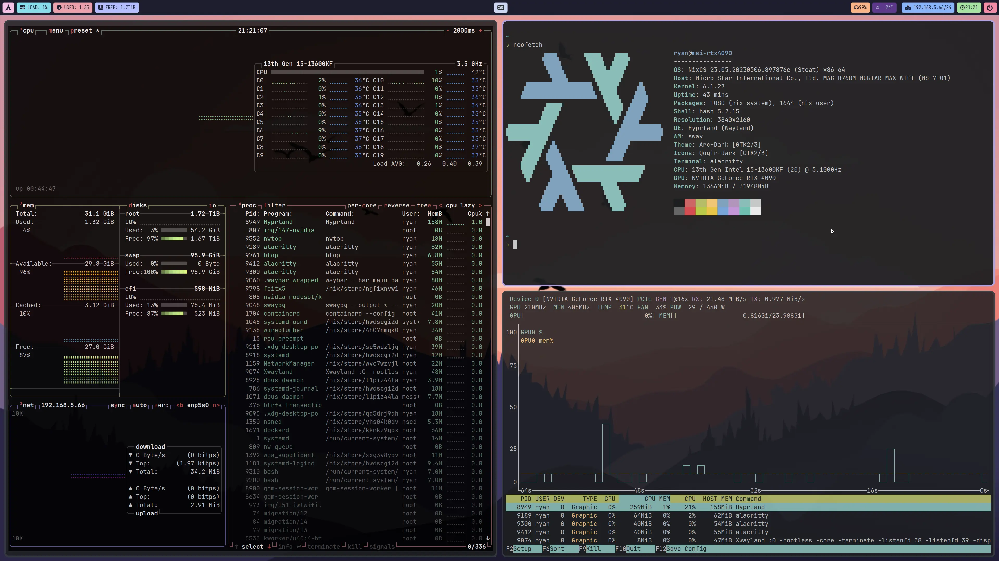

# Nix Configuration

This repository is home to the nix code that builds my systems.

## Screenshots



## TODO

- enable disk encryption to enhance data security
- make fcitx5-rime work in vscode/chrome/telegram on wayland
- auto unlock with `ssh-agent` after login
  - [People using ssh-agent, how do you unlock it on login? - reddit](https://www.reddit.com/r/NixOS/comments/lsbo9a/people_using_sshagent_how_do_you_unlock_it_on/)
- update scripts for i3wm, especially rofi & screenshot
- fix `xdg-open`: after set `firefox.desktop` as defaultApplication, NixOS returned error `no apps installed that can open "https://baidu.com"`
- `Xcursor.size` do not take effect in i3

## Why Nix?

Nix allows for easy to manage, collaborative, reproducible deployments. This means that once something is setup and configured once, it works forever. If someone else shares their configuration, anyone can make use of it.

Want to know Nix in details? Looking for a beginner-friendly tutorial? Check out [NixOS & Nix Flakes - A Guide for Beginners](https://thiscute.world/en/posts/nixos-and-flake-basics/)!

## How to Deploy this Flake?

> Note: you should NOT deploy this flake directly on your machine, it contains my hardware information and personal information which is not suitable for you. You may use this repo as a reference to build your own configuration.

After installed NixOS with `nix-command` & `flake` enabled, flow the steps below to deploy this flake.

For NixOS, use the following commands:

```bash
# deploy my test configuration
sudo nixos-rebuild switch --flake .#nixos-test


# deploy my PC's configuration
sudo nixos-rebuild switch --flake .#msi-rtx4090

# or just deploy with hostname
sudo nixos-rebuild switch

# we can also deploy using make, which is defined in Makefile
make deploy
```

For MacOS, use the following commands:

```bash
# deploy the darwin configuration(harmonicia)
make darwin

# deploy with details
make darwin-debug
```

## Install Apps from Flatpak

We can install apps from flathub, which has a lot of apps that are not supported well in nixpkgs.

```bash
# Add the Flathub repository
flatpak remote-add --if-not-exists flathub https://flathub.org/repo/flathub.flatpakrepo

# install apps from flathub
flatpak install netease-cloud-music-gtk

# install 3d printer slicer - cura
flatpak install flathub com.ultimaker.cura

# or you can search apps from flathub
flatpak search <keyword>
# search on website is also supported: https://flathub.org/
```

## Other Interesting Dotfiles

Other configurations that inspired me:

- [notwidow/hyprland](https://github.com/notwidow/hyprland): hyprland configuration
- [denisse-dev/dotfiles](https://github.com/denisse-dev/dotfiles)
- [notusknot/dotfiles-nix](https://github.com/notusknot/dotfiles-nix)
- [xddxdd/nixos-config](https://github.com/xddxdd/nixos-config)
- [bobbbay/dotfiles](https://github.com/bobbbay/dotfiles)
- [gytis-ivaskevicius/nixfiles](https://github.com/gytis-ivaskevicius/nixfiles)
- [fufexan/dotfiles](https://github.com/fufexan/dotfiles)
- [davidtwco/veritas](https://github.com/davidtwco/veritas)
- [NixOS-CN/NixOS-CN-telegram](https://github.com/NixOS-CN/NixOS-CN-telegram)
