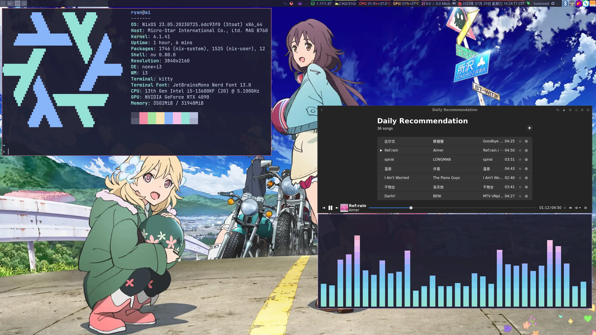
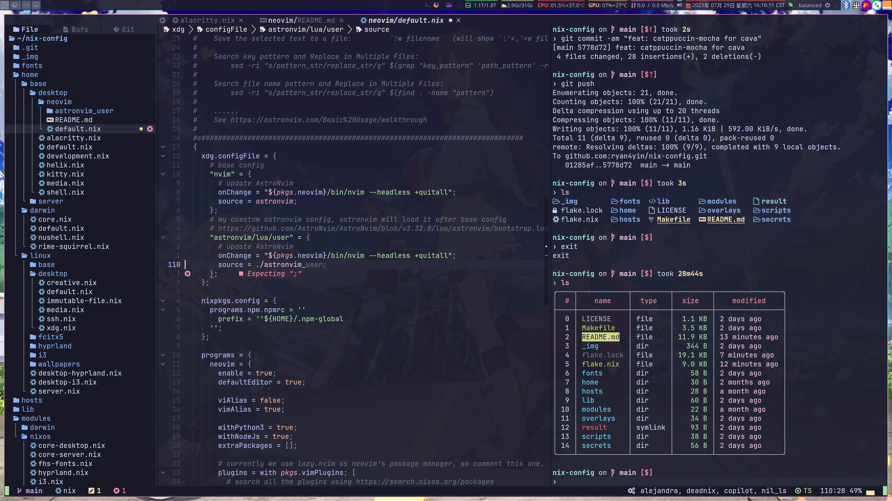

<h2 align="center">:snowflake: Ryan4Yin's Nix Config :snowflake:</h2>

<p align="center">
  
</p>

<p align="center">
	<a href="https://github.com/ryan4yin/nix-config/stargazers">
		</a>
    <a href="https://nixos.org/">
        </a>
    <a href="https://github.com/ryan4yin/nixos-and-flakes-book">
        </a>
  </a>
</p>

This repository is home to the nix code that builds my systems.

## Why NixOS & Flakes?

Nix allows for easy-to-manage, collaborative, reproducible deployments. This means that once something is setup and configured once, it works (almost) forever. If someone else shares their configuration, anyone can make use of it(if you really understand what you're copying/refering now).

As for Flakes, refer to [Introduction to Flakes - NixOS & Nix Flakes Book](https://nixos-and-flakes.thiscute.world/nixos-with-flakes/introduction-to-flakes)

**Want to know NixOS & Flaks in detail? Looking for a beginner-friendly tutorial or best practices? You don't have to go through the pain I've experienced again! Check out  my [NixOS & Nix Flakes Book - 🛠️ ❤️ An unofficial & opinionated :book: for beginners](https://github.com/ryan4yin/nixos-and-flakes-book)!**

> If you're using macOS, check out [ryan4yin/nix-darwin-kickstarter](https://github.com/ryan4yin/nix-darwin-kickstarter) for a quick start.

## Components

|                             | NixOS(Wayland)                                                                                                    | NixOS(Xorg)                                                                                                       |
| --------------------------- | :---------------------------------------------------------------------------------------------------------------- | :---------------------------------------------------------------------------------------------------------------- |
| **Window Manager**          | [Hyprland][Hyprland]                                                                                              | [i3][i3]                                                                                                          |
| **Terminal Emulator**       | [Kitty][Kitty]                                                                                                    | [Kitty][Kitty]                                                                                                    |
| **Bar**                     | [Waybar][Waybar]                                                                                                  | [i3block][i3block]                                                                                                |
| **Application Launcher**    | [anyrun][anyrun]                                                                                                  | [rofi][rofi]                                                                                                      |
| **Notification Daemon**     | [Mako][Mako]                                                                                                      | [Dunst][Dunst]                                                                                                    |
| **Display Manager**         | [GDM][GDM]                                                                                                        | [GDM][GDM]                                                                                                        |
| **Color Scheme**            | [Catppuccin][Catppuccin]                                                                                          | [Catppuccin][Catppuccin]                                                                                          |
| **network management tool** | [NetworkManager][NetworkManager]                                                                                  | [NetworkManager][NetworkManager]                                                                                  |
| **Input method framework**  | [Fcitx5][Fcitx5]                                                                                                  | [Fcitx5][Fcitx5]                                                                                                  |
| **System resource monitor** | [Btop][Btop]                                                                                                      | [Btop][Btop]                                                                                                      |
| **File Manager**            | [ranger][ranger] + [thunar][thunar]                                                                               | [ranger][ranger] + [thunar][thunar]                                                                               |
| **Shell**                   | [Nushell][Nushell] + [Starship][Starship]                                                                         | [Nushell][Nushell] + [Starship][Starship]                                                                         |
| **Music Player**            | [mpd][mpd], [ncmpcpp][ncmpcpp], [mpc][mpc], [Netease-cloud-music-gtk][netease-cloud-music-gtk]                    | [Netease-cloud-music-gtk][netease-cloud-music-gtk]                                                                |
| **Media Player**            | [mpv][mpv]                                                                                                        | [mpv][mpv]                                                                                                        |
| **Text Editor**             | [Neovim][Neovim]                                                                                                  | [Neovim][Neovim]                                                                                                  |
| **Fonts**                   | [Nerd fonts][Nerd fonts]                                                                                          | [Nerd fonts][Nerd fonts]                                                                                          |
| **Image Viewer**            | [imv][imv]                                                                                                        | [imv][imv]                                                                                                        |
| **Screenshot Software**     | [grim][grim]                                                                                                      | [flameshot](https://github.com/flameshot-org/flameshot)                                                           |
| **Screen Recording**        | [OBS][OBS]                                                                                                        | [OBS][OBS]                                                                                                        |
| **Filesystem & Encryption** | tmpfs on `/`, [Btrfs][Btrfs] subvolumes on a [LUKS][LUKS] crypted partition for persistent, unlock via passphrase | tmpfs on `/`, [Btrfs][Btrfs] subvolumes on a [LUKS][LUKS] crypted partition for persistent, unlock via passphrase |
| **Secure Boot**             | [lanzaboote][lanzaboote]                                                                                          | [lanzaboote][lanzaboote]                                                                                          |

Wallpapers: https://github.com/ryan4yin/wallpapers

## Hyprland + AstroNvim


## I3 + AstroNvim




## Neovim

See [./home/base/desktop/neovim](./home/base/desktop/neovim) for details.

## Hosts

See [./hosts](./hosts) for details.

## Secrets Management

See [./secrets](./secrets) for details.

## How to Deploy this Flake?

> :red_circle: **IMPORTANT**: **You should NOT deploy this flake directly on your machine:exclamation: It will not succeed.** this flake contains my hardware configuration(such as [hardware-configuration.nix](hosts/idols/ai/hardware-configuration.nix), [cifs-mount.nix](https://github.com/ryan4yin/nix-config/blob/v0.1.1/hosts/idols/ai/cifs-mount.nix), [Nvidia Support](https://github.com/ryan4yin/nix-config/blob/v0.1.1/hosts/idols/ai/default.nix#L77-L91), etc.) which is not suitable for your hardware, and my private secrets repository [ryan4yin/nix-secrets](https://github.com/ryan4yin/nix-config/tree/main/secrets) that only I have access to. You may use this repo as a reference to build your own configuration.

For NixOS:

> To deploy this flake from NixOS's official ISO image(purest installation method), please refer to [./nixos-installer/](./nixos-installer/)

> Need to restart the machine when switching between `wayland` and `xorg`.

```bash
# deploy one of the configuration based on the hostname
sudo nixos-rebuild switch --flake .#ai_i3
# sudo nixos-rebuild switch --flake .#ai_hyprland

# we can also deploy using `make`, which is defined in Makefile
make i3    # deploy my pc with i3 window manager
# make hypr  # deploy my pc with hyprland compositor

# or we can deploy with details
make i3-debug
# make hypr-debug
```

For macOS:

```bash
# deploy harmonicia's configuration(macOS Intel)
make ha

# deploy fern's configuration(Apple Silicon)
make fe

# deploy with details
make ha-debug
# make fe
```

> [What y'all will need when Nix drives you to drink.](https://www.youtube.com/watch?v=Eni9PPPPBpg) (copy from hlissner's dotfiles, it really matches my feelings when I first started using NixOS...)

## How to create & managage VM from this flake?

use `aquamarine` as an example, we can create a virtual machine with the following command:

```shell
# 1. generate a proxmox vma image file
nom build .#aquamarine  # `nom`(nix-output-monitor) can be replaced by the standard command `nix`

# 2. upload the genereated image to proxmox server's backup directory `/var/lib/vz/dump`
#    please replace the vma file name with the one you generated in step 1.
scp result/vzdump-qemu-aquamarine-nixos-23.11.20230603.dd49825.vma.zst root@192.168.5.174:/var/lib/vz/dump

# 3. the image we uploaded will be listed in proxmox web ui's this page: [storage 'local'] -> [backups], we can restore a vm from it via the web ui now.
```

Once the virtual machine `aquamarine` is created, we can deploy updates to it with the following commands:

```shell
# 1. add the ssh key to ssh-agent
ssh-add ~/.ssh/ai-idols

# 2. deploy the configuration to all the remote host with tag `@dist-build`
# using the ssh key we added in step 1
colmena apply --on '@dist-build' --show-trace
```

If you're not familiar with remote deployment, please read this tutorial first: [Remote Deployment - NixOS & Flakes Book](https://nixos-and-flakes.thiscute.world/best-practices/remote-deployment)

## References

Other dotfiles that inspired me:

- Nix Flakes
  - [NixOS-CN/NixOS-CN-telegram](https://github.com/NixOS-CN/NixOS-CN-telegram)
  - [notusknot/dotfiles-nix](https://github.com/notusknot/dotfiles-nix)
  - [xddxdd/nixos-config](https://github.com/xddxdd/nixos-config)
  - [bobbbay/dotfiles](https://github.com/bobbbay/dotfiles)
  - [gytis-ivaskevicius/nixfiles](https://github.com/gytis-ivaskevicius/nixfiles)
  - [davidtwco/veritas](https://github.com/davidtwco/veritas)
  - [gvolpe/nix-config](https://github.com/gvolpe/nix-config)
  - [Ruixi-rebirth/flakes](https://github.com/Ruixi-rebirth/flakes)
  - [fufexan/dotfiles](https://github.com/fufexan/dotfiles): gtk theme, xdg, git, media, anyrun, etc.
- Modularized NixOS Configuration
  - [hlissner/dotfiles](https://github.com/hlissner/dotfiles)
  - [viperML/dotfiles](https://github.com/viperML/dotfiles)
- Hyprland(wayland)
  - [notwidow/hyprland](https://github.com/notwidow/hyprland): This is where I start my hyprland journey.
  - [HeinzDev/Hyprland-dotfiles](https://github.com/HeinzDev/Hyprland-dotfiles): Refer to the waybar configuration here.
  - [linuxmobile/kaku](https://github.com/linuxmobile/kaku)
- I3 Window Manager
  - [endeavouros-i3wm-setup](https://github.com/endeavouros-team/endeavouros-i3wm-setup): I started using i3 here, and my i3 configuration is also based on it, but made a lot of changes.
  - [denisse-dev/dotfiles](https://github.com/denisse-dev/dotfiles)
- Neovim/AstroNvim
  - [maxbrunet/dotfiles](https://github.com/maxbrunet/dotfiles): astronvim with nix flakes.
- Misc
  - [1amSimp1e/dots](https://github.com/1amSimp1e/dots)

[Hyprland]: https://github.com/hyprwm/Hyprland
[i3]: https://github.com/i3/i3
[Kitty]: https://github.com/kovidgoyal/kitty
[Nushell]: https://github.com/nushell/nushell
[Starship]: https://github.com/starship/starship
[Waybar]: https://github.com/Alexays/Waybar
[i3block]: https://github.com/vivien/i3blocks
[rofi]: https://github.com/davatorium/rofi
[anyrun]: https://github.com/Kirottu/anyrun
[Dunst]: https://github.com/dunst-project/dunst
[Fcitx5]: https://github.com/fcitx/fcitx5
[Btop]: https://github.com/aristocratos/btop
[mpv]: https://github.com/mpv-player/mpv
[Neovim]: https://github.com/neovim/neovim
[AstroNvim]: https://github.com/AstroNvim/AstroNvim
[flameshot]: https://github.com/flameshot-org/flameshot
[grim]: https://github.com/emersion/grim
[imv]: https://sr.ht/~exec64/imv/
[OBS]: https://obsproject.com
[Mako]: https://github.com/emersion/mako
[Nerd fonts]: https://github.com/ryanoasis/nerd-fonts
[catppuccin]: https://github.com/catppuccin/catppuccin
[mpd]: https://github.com/MusicPlayerDaemon/MPD
[ncmpcpp]: https://github.com/ncmpcpp/ncmpcpp
[mpc]: https://github.com/MusicPlayerDaemon/mpc
[Netease-cloud-music-gtk]: https://github.com/gmg137/netease-cloud-music-gtk
[NetworkManager]: https://wiki.gnome.org/Projects/NetworkManager
[wl-clipboard]: https://github.com/bugaevc/wl-clipboard
[GDM]: https://wiki.archlinux.org/title/GDM
[thunar]: https://gitlab.xfce.org/xfce/thunar
[ranger]: https://github.com/ranger/ranger
[Catppuccin]: https://github.com/catppuccin/catppuccin
[Btrfs]: https://btrfs.readthedocs.io
[LUKS]: https://wiki.archlinux.org/title/Dm-crypt/Encrypting_an_entire_system
[lanzaboote]: https://github.com/nix-community/lanzaboote
