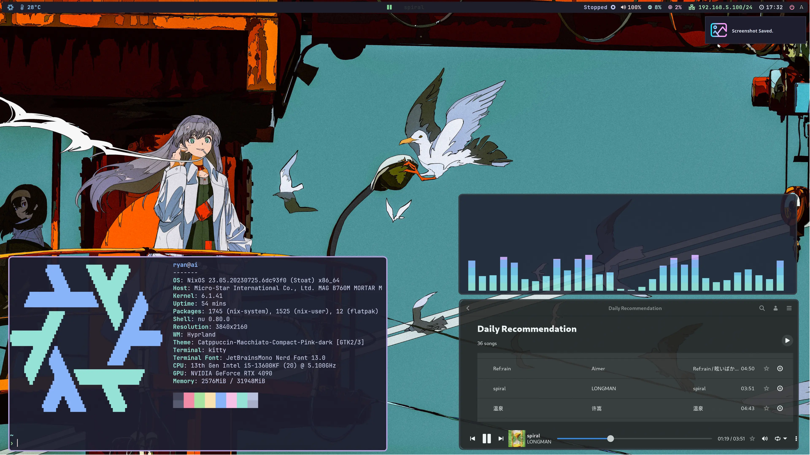
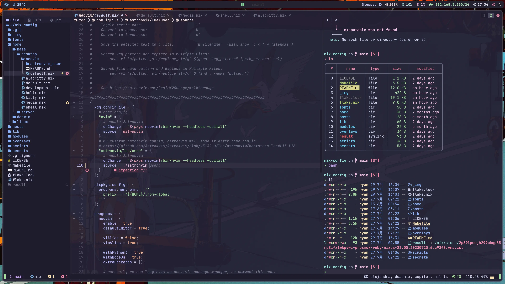
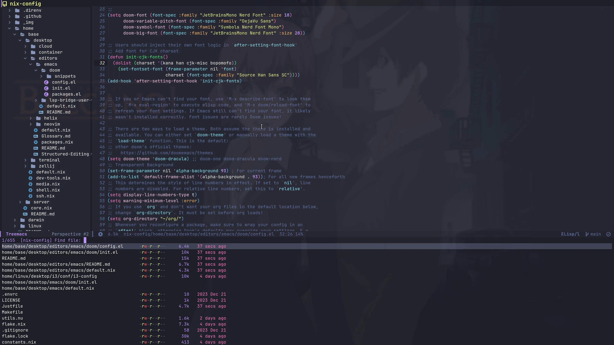

<h2 align="center">:snowflake: Ryan4Yin's Nix Config :snowflake:</h2>

<p align="center">
  
</p>

<p align="center">
	<a href="https://github.com/ryan4yin/nix-config/stargazers">
		</a>
    <a href="https://nixos.org/">
        </a>
    <a href="https://github.com/ryan4yin/nixos-and-flakes-book">
        </a>
  </a>
</p>

> My configuration is becoming more and more complex, and **it will be difficult for beginners to
> read**. If you are new to NixOS and want to know how I use NixOS, I would recommend you to take a
> look at the [ryan4yin/nix-config/releases](https://github.com/ryan4yin/nix-config/releases) first,
> **checkout to some simpler older versions, such as
> [i3-kickstarter](https://github.com/ryan4yin/nix-config/tree/i3-kickstarter), which will be much
> easier to understand**.

This repository is home to the nix code that builds my systems:

1. NixOS Desktops: NixOS with home-manager, hyprland, agenix, etc.
2. macOS Desktops: nix-darwin with home-manager, share the same home-manager configuration with
   NixOS Desktops.
3. NixOS Servers: virtual machines running on Proxmox/KubeVirt, with various services, such as
   kubernetes, homepage, prometheus, grafana, etc.

See [./hosts](./hosts) for details of each host.

See [./Virtual-Machine.md](./Virtual-Machine.md) for details of how to create & manage KubeVirt's
Virtual Machine from this flake.

## Why NixOS & Flakes?

Nix allows for easy-to-manage, collaborative, reproducible deployments. This means that once
something is setup and configured once, it works (almost) forever. If someone else shares their
configuration, anyone else can just use it (if you really understand what you're copying/refering
now).

As for Flakes, refer to
[Introduction to Flakes - NixOS & Nix Flakes Book](https://nixos-and-flakes.thiscute.world/nixos-with-flakes/introduction-to-flakes)

**Want to know NixOS & Flaks in detail? Looking for a beginner-friendly tutorial or best practices?
You don't have to go through the pain I've experienced again! Check out my
[NixOS & Nix Flakes Book - 🛠️ ❤️ An unofficial & opinionated :book: for beginners](https://github.com/ryan4yin/nixos-and-flakes-book)!**

> If you're using macOS, check out
> [ryan4yin/nix-darwin-kickstarter](https://github.com/ryan4yin/nix-darwin-kickstarter) for a quick
> start.

## Components

|                             | NixOS(Wayland)                                                                                                      |
| --------------------------- | ------------------------------------------------------------------------------------------------------------------- |
| **Window Manager**          | [Hyprland][Hyprland]                                                                                                |
| **Terminal Emulator**       | [Zellij][Zellij] + [Kitty][Kitty]                                                                                   |
| **Bar**                     | [Waybar][Waybar]                                                                                                    |
| **Application Launcher**    | [anyrun][anyrun]                                                                                                    |
| **Notification Daemon**     | [Mako][Mako]                                                                                                        |
| **Display Manager**         | [GDM][GDM]                                                                                                          |
| **Color Scheme**            | [Catppuccin][Catppuccin]                                                                                            |
| **network management tool** | [NetworkManager][NetworkManager]                                                                                    |
| **Input method framework**  | [Fcitx5][Fcitx5]                                                                                                    |
| **System resource monitor** | [Btop][Btop]                                                                                                        |
| **File Manager**            | [Yazi][Yazi] + [thunar][thunar]                                                                                     |
| **Shell**                   | [Nushell][Nushell] + [Starship][Starship]                                                                           |
| **Music Player**            | [mpd][mpd], [ncmpcpp][ncmpcpp], [mpc][mpc]                                                                          |
| **Media Player**            | [mpv][mpv]                                                                                                          |
| **Text Editor**             | [Neovim][Neovim] + [DoomEmacs][DoomEmacs]                                                                           |
| **Fonts**                   | [Nerd fonts][Nerd fonts]                                                                                            |
| **Image Viewer**            | [imv][imv]                                                                                                          |
| **Screenshot Software**     | [flameshot][flameshot] + [grim][grim]                                                                               |
| **Screen Recording**        | [OBS][OBS]                                                                                                          |
| **Filesystem & Encryption** | tmpfs on `/`, [Btrfs][Btrfs] subvolumes on a [LUKS][LUKS] encrypted partition for persistent, unlock via passphrase |
| **Secure Boot**             | [lanzaboote][lanzaboote]                                                                                            |

Wallpapers: https://github.com/ryan4yin/wallpapers

## Hyprland + AstroNvim + DoomEmacs







## Neovim

See [./home/base/tui/editors/neovim/](./home/base/tui/editors/neovim/) for details.

## Emacs

See [./home/base/tui/editors/emacs/](./home/base/tui/editors/emacs/) for details.

## Secrets Management

See [./secrets](./secrets) for details.

## How to Deploy this Flake?

<!-- prettier-ignore -->
> :red_circle: **IMPORTANT**: **You should NOT deploy this flake directly on your machine :exclamation:
> It will not succeed.** This flake contains my hardware configuration(such as
> [hardware-configuration.nix](hosts/idols-ai/hardware-configuration.nix),
> [Nvidia Support](https://github.com/ryan4yin/nix-config/blob/v0.1.1/hosts/idols-ai/default.nix#L77-L91),
> etc.) which is not suitable for your hardwares, and requires my private secrets repository
> [ryan4yin/nix-secrets](https://github.com/ryan4yin/nix-config/tree/main/secrets) to deploy. You
> may use this repo as a reference to build your own configuration.

For NixOS:

> To deploy this flake from NixOS's official ISO image(purest installation method), please refer to
> [./nixos-installer/](./nixos-installer/)

> Need to restart the machine when switching between `wayland` and `xorg`.

```bash
# deploy one of the configuration based on the hostname
sudo nixos-rebuild switch --flake .#ai-hyprland

# deploy via `just`(a command runner with similar syntax to make) & Justfile
just hypr  # deploy my pc with hyprland compositor

# or we can deploy with details
just hypr debug
```

For macOS:

```bash
# If you are deploying for the first time,
# 1. install nix & homebrew manually.
# 2. prepare the deployment environment with essential packages available
nix-shell -p just nushell
# 3. comment home-manager's code in lib/macosSystem.nix to speed up the first deplyment.
# 4. comment out the proxy settings in scripts/darwin_set_proxy.py if the proxy is not ready yet.

# 4. deploy harmonica's configuration(macOS Intel)
just ha

# deploy fern's configuration(Apple Silicon)
just fe

# deploy with details
just ha debug
# just fe debug
```

> [What y'all will need when Nix drives you to drink.](https://www.youtube.com/watch?v=Eni9PPPPBpg)
> (copy from hlissner's dotfiles, it really matches my feelings when I first started using NixOS...)

## References

Other dotfiles that inspired me:

- Nix Flakes
  - [NixOS-CN/NixOS-CN-telegram](https://github.com/NixOS-CN/NixOS-CN-telegram)
  - [notusknot/dotfiles-nix](https://github.com/notusknot/dotfiles-nix)
  - [xddxdd/nixos-config](https://github.com/xddxdd/nixos-config)
  - [bobbbay/dotfiles](https://github.com/bobbbay/dotfiles)
  - [gytis-ivaskevicius/nixfiles](https://github.com/gytis-ivaskevicius/nixfiles)
  - [davidtwco/veritas](https://github.com/davidtwco/veritas)
  - [gvolpe/nix-config](https://github.com/gvolpe/nix-config)
  - [Ruixi-rebirth/flakes](https://github.com/Ruixi-rebirth/flakes)
  - [fufexan/dotfiles](https://github.com/fufexan/dotfiles): gtk theme, xdg, git, media, anyrun,
    etc.
  - [nix-community/srvos](https://github.com/nix-community/srvos): a collection of opinionated and
    sharable NixOS configurations for servers
- Modularized NixOS Configuration
  - [hlissner/dotfiles](https://github.com/hlissner/dotfiles)
  - [viperML/dotfiles](https://github.com/viperML/dotfiles)
- Hyprland(wayland)
  - [notwidow/hyprland](https://github.com/notwidow/hyprland): This is where I start my hyprland
    journey.
  - [HeinzDev/Hyprland-dotfiles](https://github.com/HeinzDev/Hyprland-dotfiles): Refer to the waybar
    configuration here.
  - [linuxmobile/kaku](https://github.com/linuxmobile/kaku)
- Neovim/AstroNvim
  - [maxbrunet/dotfiles](https://github.com/maxbrunet/dotfiles): astronvim with nix flakes.
- Misc
  - [1amSimp1e/dots](https://github.com/1amSimp1e/dots)

[Hyprland]: https://github.com/hyprwm/Hyprland
[Kitty]: https://github.com/kovidgoyal/kitty
[Nushell]: https://github.com/nushell/nushell
[Starship]: https://github.com/starship/starship
[Waybar]: https://github.com/Alexays/Waybar
[polybar]: https://github.com/polybar/polybar
[rofi]: https://github.com/davatorium/rofi
[anyrun]: https://github.com/Kirottu/anyrun
[Dunst]: https://github.com/dunst-project/dunst
[Fcitx5]: https://github.com/fcitx/fcitx5
[Btop]: https://github.com/aristocratos/btop
[mpv]: https://github.com/mpv-player/mpv
[Zellij]: https://github.com/zellij-org/zellij
[Neovim]: https://github.com/neovim/neovim
[AstroNvim]: https://github.com/AstroNvim/AstroNvim
[DoomEmacs]: https://github.com/doomemacs/doomemacs
[flameshot]: https://github.com/flameshot-org/flameshot
[grim]: https://github.com/emersion/grim
[flameshot]: https://github.com/flameshot-org/flameshot
[imv]: https://sr.ht/~exec64/imv/
[OBS]: https://obsproject.com
[Mako]: https://github.com/emersion/mako
[Nerd fonts]: https://github.com/ryanoasis/nerd-fonts
[catppuccin]: https://github.com/catppuccin/catppuccin
[mpd]: https://github.com/MusicPlayerDaemon/MPD
[ncmpcpp]: https://github.com/ncmpcpp/ncmpcpp
[mpc]: https://github.com/MusicPlayerDaemon/mpc
[Netease-cloud-music-gtk]: https://github.com/gmg137/netease-cloud-music-gtk
[NetworkManager]: https://wiki.gnome.org/Projects/NetworkManager
[wl-clipboard]: https://github.com/bugaevc/wl-clipboard
[GDM]: https://wiki.archlinux.org/title/GDM
[thunar]: https://gitlab.xfce.org/xfce/thunar
[Yazi]: https://github.com/sxyazi/yazi
[Catppuccin]: https://github.com/catppuccin/catppuccin
[Btrfs]: https://btrfs.readthedocs.io
[LUKS]: https://wiki.archlinux.org/title/Dm-crypt/Encrypting_an_entire_system
[lanzaboote]: https://github.com/nix-community/lanzaboote
