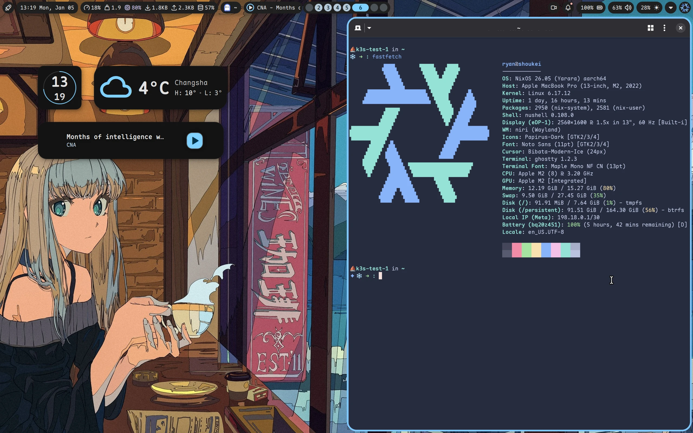
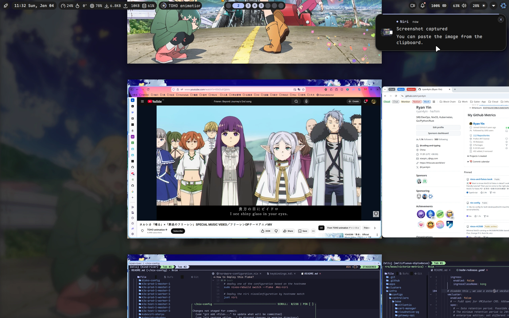
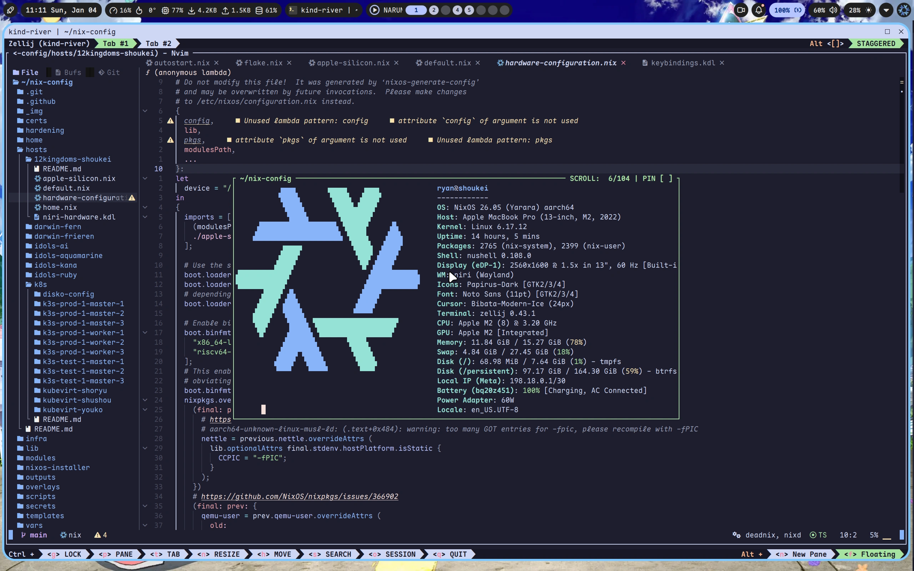

<h2 align="center">:snowflake: Ryan4Yin's Nix Config :snowflake:</h2>

<p align="center">
  
</p>

<p align="center">
	<a href="https://github.com/ryan4yin/nix-config/stargazers">
		</a>
    <a href="https://nixos.org/">
        </a>
    <a href="https://github.com/ryan4yin/nixos-and-flakes-book">
        </a>
  </a>
</p>

> My configuration is becoming more and more complex, and **it will be difficult for beginners to
> read**. If you are new to NixOS and want to know how I use NixOS, I would recommend you to take a
> look at the [ryan4yin/nix-config/releases](https://github.com/ryan4yin/nix-config/releases) first,
> **check out to some simpler older versions, such as
> [i3-kickstarter](https://github.com/ryan4yin/nix-config/tree/i3-kickstarter), which will be much
> easier to understand**.

This repository is home to the Nix code that builds all of my systems:

1. **NixOS desktops** — Home Manager, [Niri][Niri] (Wayland), the [Noctalia][noctalia] shell,
   agenix.
2. **macOS desktops** — nix-darwin + Home Manager, sharing the same `home/` configuration with the
   NixOS desktops.
3. **NixOS servers** — VMs running on three physical mini PCs, hosting K3s clusters,
   monitoring, and other self-hosted services.

See [./hosts](./hosts) for the host inventory, [./outputs](./outputs) for how the flake outputs are
composed, [./Virtual-Machine.md](./Virtual-Machine.md) for creating & managing VMs, and
[./AGENTS.md](./AGENTS.md) for the repository conventions.

## Why NixOS & Flakes?

Nix allows for easy-to-manage, collaborative, reproducible deployments. This means that once
something is setup and configured once, it works (almost) forever. If someone else shares their
configuration, anyone else can just use it (if you really understand what you're copying/referring
now).

As for Flakes, refer to
[Introduction to Flakes - NixOS & Nix Flakes Book](https://nixos-and-flakes.thiscute.world/nixos-with-flakes/introduction-to-flakes)

**Want to know NixOS & Flakes in detail? Looking for a beginner-friendly tutorial or best practices?
You don't have to go through the pain I've experienced again! Check out my
[NixOS & Nix Flakes Book - 🛠️ ❤️ An unofficial & opinionated :book: for beginners](https://github.com/ryan4yin/nixos-and-flakes-book)!**

> If you're using macOS, check out
> [ryan4yin/nix-darwin-kickstarter](https://github.com/ryan4yin/nix-darwin-kickstarter) for a quick
> start.

## Components

|                             | NixOS (Wayland)                                                                                                          |
| --------------------------- | ------------------------------------------------------------------------------------------------------------------------ |
| **Display Manager**         | [greetd][greetd] + [tuigreet][tuigreet]                                                                                  |
| **Window Manager**          | [Niri][Niri]                                                                                                             |
| **Desktop Shell**           | [Noctalia][noctalia] — bar/notifications/launcher/lock screen/control center/power menu/screenshots, one native shell    |
| **Terminal Emulators**      | [foot][foot], [Kitty][Kitty], [Alacritty][Alacritty], [Ghostty][Ghostty]                                                 |
| **Terminal Multiplexer**    | [Zellij][Zellij]                                                                                                         |
| **Shell**                   | [Nushell][Nushell] + [Starship][Starship]                                                                                |
| **Editors / IDE**           | [Zed][Zed] (GUI, primary), VS Code (GUI); [Helix][Helix] (TUI, primary), [Neovim][Neovim] (TUI, backup)                  |
| **Color Scheme**            | [catppuccin-nix][catppuccin-nix]                                                                                         |
| **Networking**              | systemd-networkd / [NetworkManager][NetworkManager]                                                                      |
| **Input Method**            | [Fcitx5][Fcitx5] + [rime][rime] + [小鹤音形 flypy][flypy]                                                                |
| **System Monitor**          | [Btop][Btop] (+ Noctalia's built-in sysmon widgets)                                                                      |
| **File Manager**            | [Yazi][Yazi] (TUI) + [thunar][thunar] (GUI)                                                                              |
| **Media Player**            | [mpv][mpv]                                                                                                               |
| **Image Viewer**            | [imv][imv]                                                                                                               |
| **Screenshots**             | Native Noctalia capture: region / fullscreen / display picker, with a built-in annotation editor                         |
| **Screen Recording**        | [OBS][OBS], gpu-screen-recorder, wf-recorder                                                                             |
| **Fonts**                   | [Nerd fonts][Nerd fonts]                                                                                                 |
| **Filesystem & Encryption** | tmpfs as `/`, [Btrfs][Btrfs] subvolumes on a [LUKS][LUKS] encrypted partition for persistent data; unlock via passphrase |
| **Secure Boot**             | [lanzaboote][lanzaboote]                                                                                                 |

Wallpapers: https://github.com/ryan4yin/wallpapers

## Screenshots







## Editors / IDE

- **Terminal editors:** [./home/base/core/editors/](./home/base/core/editors/) — Helix / Neovim,
  `$EDITOR`, docs.
- **GUI editors:** [Zed](./home/base/gui/zed-editor.nix) (primary) and
  [VS Code](./home/linux/gui/base/vscode.nix).
- **LLM coding agents:** [./agents](./agents/) — rules, installers, CLI snippets; see
  [./agents/README.md](./agents/README.md).

## Secrets Management

See [./secrets](./secrets) for details.

## How to Deploy this Flake?

<!-- prettier-ignore -->
> :red_circle: **IMPORTANT**: **You should NOT deploy this flake directly on your machine :exclamation:
> It will not succeed.** This flake contains my hardware configuration (such as
> [hardware-configuration.nix](hosts/idols-ai/hardware-configuration.nix),
> [Nvidia support](hosts/idols-ai/hardware-nvidia.nix), etc.) which is not suitable for your
> hardware, and requires my private secrets repository
> [ryan4yin/nix-secrets](https://github.com/ryan4yin/nix-config/tree/main/secrets) to deploy. You
> may use this repo as a reference to build your own configuration.

Run `just --list` to see every recipe.

For NixOS:

> To deploy this flake from NixOS's official ISO image (purest installation method), please refer to
> [./nixos-installer/](./nixos-installer)

```bash
# Desktops: deploy the <hostname>-niri nixosConfiguration (e.g. ai-niri, shoukei-niri)
just niri           # equals `sudo nixos-rebuild switch --flake .#<hostname>-niri`
just niri boot      # set as the next boot configuration without switching
just niri switch debug  # detailed output

# Other hosts (servers, VMs): deploy the nixosConfiguration matching the bare hostname
just local
just local boot
just local switch debug
```

For macOS (nix-darwin):

```bash
# If you are deploying for the first time,
# 1. install nix & homebrew manually.
# 2. prepare the deployment environment with essential packages available
nix-shell -p just nushell
# 3. comment home-manager's code in lib/macosSystem.nix to speed up the first deployment.
# 4. comment out the proxy settings in scripts/darwin_set_proxy.py if the proxy is not ready yet.

# Deploy the darwinConfiguration by hostname match (fern, frieren)
just local
just local debug  # detailed output (macOS has no switch/boot mode)
```

Remote / cluster hosts are deployed with [Colmena](https://github.com/zhaofengli/colmena) on top of
the same flake, e.g. `just col <tag>`, `just k3s-test`, `just lab`.

> [What y'all will need when Nix drives you to drink.](https://www.youtube.com/watch?v=Eni9PPPPBpg)
> (copy from hlissner's dotfiles, it really matches my feelings when I first started using NixOS...)

## Validation & Development

`nix develop` provides the formatters and linters used by the repository. The most useful commands:

```bash
just test    # eval tests across Linux & Darwin; the output must be `true`
just fmt     # format all Nix files with nixfmt
just --list  # all recipes

nix flake check   # broader flake checks
```

For Nix changes, run `just test` and inspect `just fmt`'s diff before committing. Non-Nix files are
formatted with `prettier`; spelling is checked with `typos`.

## References

Other dotfiles that inspired me:

- Nix Flakes
  - [NixOS-CN/NixOS-CN-telegram](https://github.com/NixOS-CN/NixOS-CN-telegram)
  - [notusknot/dotfiles-nix](https://github.com/notusknot/dotfiles-nix)
  - [xddxdd/nixos-config](https://github.com/xddxdd/nixos-config)
  - [bobbbay/dotfiles](https://github.com/bobbbay/dotfiles)
  - [gytis-ivaskevicius/nixfiles](https://github.com/gytis-ivaskevicius/nixfiles)
  - [davidtwco/veritas](https://github.com/davidtwco/veritas)
  - [gvolpe/nix-config](https://github.com/gvolpe/nix-config)
  - [Ruixi-rebirth/flakes](https://github.com/Ruixi-rebirth/flakes)
  - [fufexan/dotfiles](https://github.com/fufexan/dotfiles): gtk theme, xdg, git, media, etc.
  - [nix-community/srvos](https://github.com/nix-community/srvos): a collection of opinionated and
    sharable NixOS configurations for servers
- Modularized NixOS Configuration
  - [hlissner/dotfiles](https://github.com/hlissner/dotfiles)
  - [viperML/dotfiles](https://github.com/viperML/dotfiles)
- Neovim / AstroNvim
  - [maxbrunet/dotfiles](https://github.com/maxbrunet/dotfiles): astronvim with nix flakes.
- Misc
  - [1amSimp1e/dots](https://github.com/1amSimp1e/dots)

[Niri]: https://github.com/YaLTeR/niri
[greetd]: https://github.com/kennylevinsen/greetd
[Kitty]: https://github.com/kovidgoyal/kitty
[foot]: https://codeberg.org/dnkl/foot
[Alacritty]: https://github.com/alacritty/alacritty
[Ghostty]: https://github.com/ghostty-org/ghostty
[Nushell]: https://github.com/nushell/nushell
[Starship]: https://github.com/starship/starship
[Fcitx5]: https://github.com/fcitx/fcitx5
[rime]: https://wiki.archlinux.org/title/Rime
[flypy]: https://flypy.cc/
[Btop]: https://github.com/aristocratos/btop
[mpv]: https://github.com/mpv-player/mpv
[Zellij]: https://github.com/zellij-org/zellij
[Helix]: https://github.com/helix-editor/helix
[Neovim]: https://github.com/neovim/neovim
[Zed]: https://zed.dev
[imv]: https://sr.ht/~exec64/imv/
[OBS]: https://obsproject.com
[Nerd fonts]: https://github.com/ryanoasis/nerd-fonts
[catppuccin-nix]: https://github.com/catppuccin/nix
[NetworkManager]: https://wiki.gnome.org/Projects/NetworkManager
[tuigreet]: https://github.com/apognu/tuigreet
[thunar]: https://gitlab.xfce.org/xfce/thunar
[Yazi]: https://github.com/sxyazi/yazi
[Btrfs]: https://btrfs.readthedocs.io
[LUKS]: https://wiki.archlinux.org/title/Dm-crypt/Encrypting_an_entire_system
[lanzaboote]: https://github.com/nix-community/lanzaboote
[noctalia]: https://github.com/noctalia-dev/noctalia
