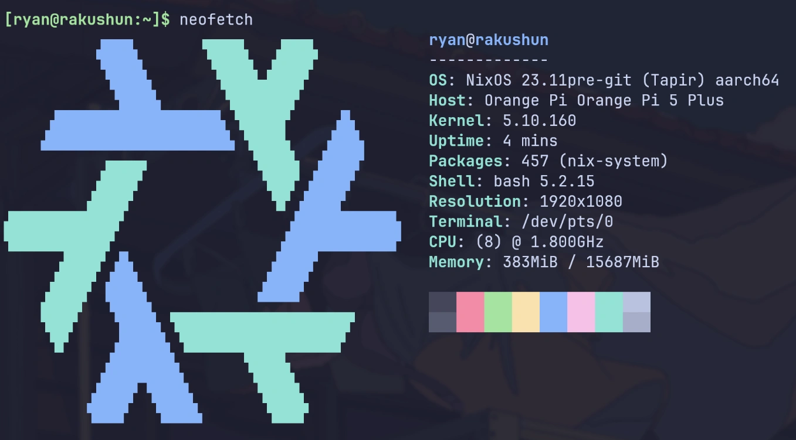

# Rakushun - Orange Pi 5 Plus

LUKS encrypted SSD for NixOS, on Orange Pi 5 Plus.

Host running storage, operation and maintenance related services:

1. Storage such as git server, file server/browser, torrent downloader,, etc.
1. Backup or sync my personal data to cloud or NAS.
   - For safety, those data should be encrypted before sending to the cloud or my NAS.
1. Collect and monitor the metrics/logs of my homelab.

## Showcases



## Features

Services:

1. prometheus + alertmanager + grafana + loki: Monitor the metrics/logs of my homelab.
1. restic: Backup my personal data to cloud or NAS.
1. synthing: Sync file between android/macbook/PC and NAS.
1. gitea: Self-hosted git service.
1. sftpgo: SFTP server.
1. transmission & AriaNg: Torrent downloader and HTTP downloader
1. alist/filebrower: File browser for local/SMB/Cloud

All the services assumes a reverse proxy to be setup in the front, they are all listening on
localhost, and a caddy service is listening on the local network interface and proxy the requests to
the services.

TODO: create a private PKI for caddy, to achieve end-to-end encryption between caddy and the
services.

## Misc

```bash
# copy closure to another arm64 machine
nix-copy-closure --to root@suzu  /run/current-system
```
