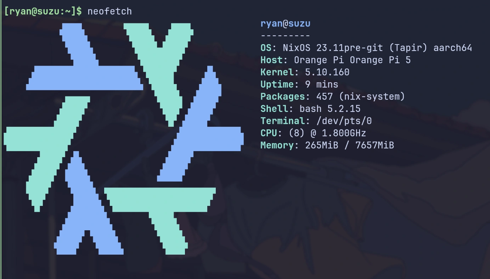

# Suzu - Orange Pi 5

LUKS encrypted SSD for NixOS, on Orange Pi 5.

## TODOs

- [ ] Add support for BGP routing.
  - [Comparing Open Source BGP Stacks](https://elegantnetwork.github.io/posts/comparing-open-source-bgp-stacks/)
  - [`services.frr.*` - search.nixos.org](https://search.nixos.org/options?channel=unstable&query=services.frr)

## Showcases

## Features

Micro VMs:

1. suzi: dae router(transparent proxy, dhcp)
1. mitsuha: tailscale gateway(sub router)

Services:

1. OCI Containers: to run some servides that's not available in NixOS.
1. ddns
1. uptime-kuma: uptime monitoring
1. excalidraw/DDTV/owncast/jitsi-meet/...

All the services assumes a reverse proxy to be setup in the front, they are all listening on
localhost, and a caddy service is listening on the local network interface and proxy the requests to
the services.

TODO: create a private PKI for caddy, to achieve end-to-end encryption between caddy and the
services.
