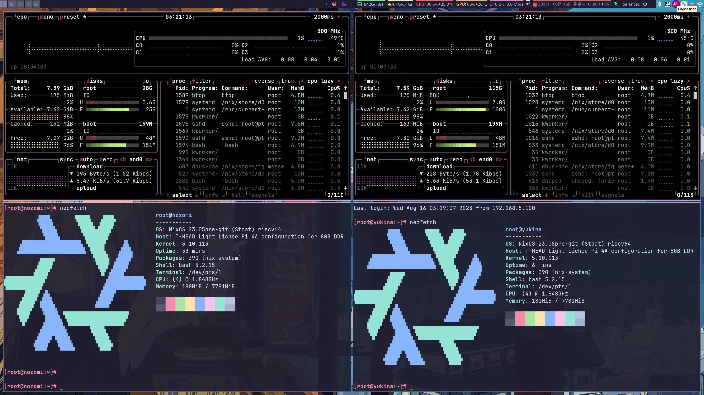
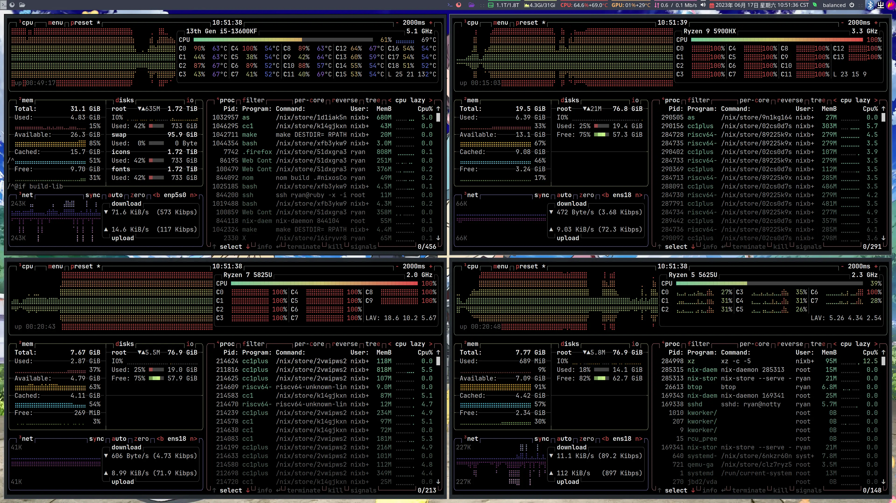
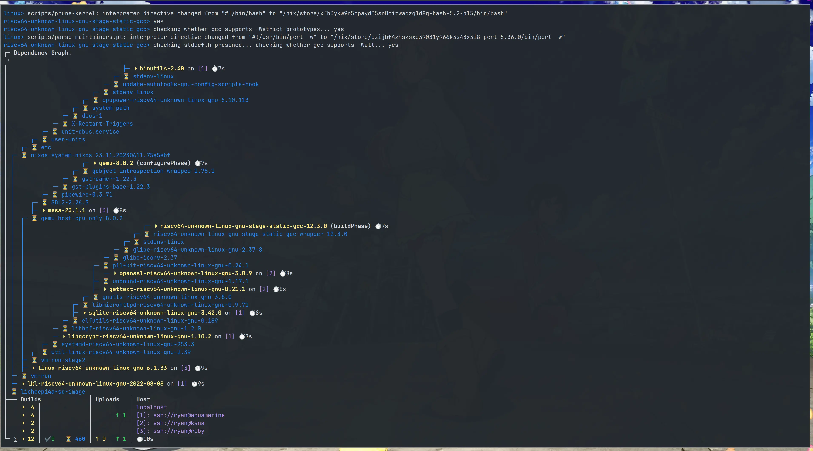

# Hosts

This directory contains all host-specific configurations for my NixOS and macOS systems.

## Current Host Inventory

### Physical Machines

#### `idols` - Main Workstations

Named after characters from "Oshi no Ko":

| Host         | Platform        | Hardware                                | Purpose               | Status      |
| ------------ | --------------- | --------------------------------------- | --------------------- | ----------- |
| `ai`         | NixOS           | Ultra 7 270K Plus + RTX 4090, 128G DDR5 | Gaming & Daily Use    | ✅ Active   |
| `aquamarine` | NixOS (libvirt) | Virtual                                 | Monitoring & Services | ⚪ Not Used |
| `kana`       | NixOS (libvirt) | Virtual                                 | Run AI Agents         | ✅ Active   |
| `ruby`       | NixOS (libvirt) | Virtual                                 | Run AI Agents         | ✅ Active   |
| `akane`      | NixOS (aarch64) | Virtual (UTM)                           | aarch64 test VM       | ✅ Active   |

`aquamarine` is retired; its services now run directly on `youko`
(`hosts/12kingdoms-youko/homelab-services/`).

On 2026-04-27 `ai` was rebuilt on a new platform. The MSI board and i5-13600KF it was added with in
2023-05 (the host was originally named `msi-rtx4090`) gave way to the Colorful CVN Z890 ARK FROZEN +
Intel Core Ultra 7 270K Plus. The traces in the history are PR #257 (the NIC moved from `enp5s0` to
`enp130s0`) and PR #258 (Niri output names renamed, `hardware-intel.nix` added with the Arrow Lake
NPU, kernel moved to `linuxPackages_latest`). The 2×48G DDR5 kit was already in place at that point;
the repo has no record of when it went in.

On 2026-10-06 `ai` grew from 2×48G (96G) to 2×48G + 2×16G (128G) across all four DIMM slots, at
DDR5-4800 with XMP off — the only stable setting with four DIMMs on this board. The 16G pair must be
installed first; with the 48G pair in first the board does not POST. The bring-up order, the BIOS
settings, the stress-test recipe, and how to recover a board that will not POST are in
[`idols-ai/MIXED-MEMORY.md`](./idols-ai/MIXED-MEMORY.md).

#### `darwin` - macOS Systems

Named after characters from "Frieren: Beyond Journey's End":

| Host      | Platform | Hardware                   | Purpose      | Status    |
| --------- | -------- | -------------------------- | ------------ | --------- |
| `fern`    | macOS    | MacBook Pro M2 13" 16GB    | Personal Use | ✅ Active |
| `frieren` | macOS    | MacBook Pro M4Pro 14" 48GB | Work Use     | ✅ Active |

#### `12kingdoms` - Homelab Servers & Apple Silicon Linux

Named after "Twelve Kingdoms":

| Host      | Platform | Hardware                             | Purpose                | Status    |
| --------- | -------- | ------------------------------------ | ---------------------- | --------- |
| `shoukei` | NixOS    | MacBook Pro M2                       | NixOS on Apple Silicon | ✅ Active |
| `shoryu`  | NixOS    | MoreFine S500+ (AMD Ryzen 7 5825U)   | VM Host                | ✅ Active |
| `shushou` | NixOS    | MinisForum UM560 (AMD Ryzen 5 5625U) | VM Host                | ✅ Active |
| `youko`   | NixOS    | Beelink GTR5 (AMD Ryzen 9 5900HX)    | Homelab Core           | ✅ Active |

On 2026-09-29 the NVMe SSDs of `youko` and `shushou` were physically swapped, and the 2×4TB USB HDDs
moved with the `youko` role to the other chassis. The reason was Jellyfin: HDR transcoding on the
5625U's Barceló iGPU could not keep up (~0.4–0.8×), while the 5900HX's Cezanne iGPU can (~1.68× for
1080p HDR). So the homelab-core role (all services + the k3s VMs + the HDDs + the UPS) now runs on
the Beelink GTR5 and the k3s VM-host role on the UM560; the other services moving along is a side
effect of swapping the role's disk, not a separate migration. Hostnames, IPs, and state followed the
disks.

### Virtual Machines & Clusters

#### `k8s` - Kubernetes Infrastructure

- **VM Cluster**: 3 physical mini PCs (shoryu, shushou, youko) running all VMs
- **K3s Testing**: `k3s-test-1` control plane and workers, running as microVMs; placement and
  rollout are documented in [`k8s/README.md`](./k8s/README.md)

### External Systems

- **SBCs**: aarch64/riscv64 single-board computers managed in
  [ryan4yin/nixos-config-sbc](https://github.com/ryan4yin/nixos-config-sbc)

All my riscv64 hosts:



## Naming Conventions

- **idols**: Characters from "Oshi no Ko" anime/manga
- **12kingdoms**: Characters from "Twelve Kingdoms" anime/novel series
- **darwin**: Characters from "Frieren: Beyond Journey's End" anime/manga
- **k8s**: Kubernetes-related systems follow standard naming patterns

## How to Add a New Host

Copy the closest existing host and adapt it. The step-by-step procedure, including the outputs and
networking wiring, secrets, and the eval tests a new host must pass, is in
[`.agents/skills/nix-config-new-host/SKILL.md`](../.agents/skills/nix-config-new-host/SKILL.md).

## Deploying VM Hosts

The three VM hosts (`shoryu`, `shushou`, `youko`) put their VMs on the Linux bridge `br0`, with the
physical NIC as a bridge port. NixOS guests run as microVMs (`microvm.nix`); the `k3s-test-1`
cluster is microVMs on top, using Cilium as its pod network (flannel disabled). Full-machine guests
run with qemu-kvm under libvirt instead: `shoryu` is the only host that enables `libvirtd` today
(the agent desktops `kana`/`ruby`). Non-NixOS guests (Ubuntu, Windows, Qubes OS) would take the same
qemu-kvm path; there are none right now.

- `switch` is fine for changes that don't touch the network stack (e.g. journald or other service
  settings). Deploy serially (`-p 1`) and re-check VM reachability afterwards.
- Use `boot` + a serial reboot for anything that can drop the network mid-flight — `systemd.network`
  / `br0` changes, nixpkgs updates, or any broad rebuild.
- If a host loses VM networking, check `br0` and the VM taps, or reboot the host.

## Common Build Commands

Use the Just recipes for host configuration checks and builds:

```sh
just eval-host <host>
just build-host <host>
```

`eval-host` only evaluates the configuration. `build-host` builds the system closure without
activating it. Host activation remains an explicit Colmena operation such as `just shoryu`,
`just shushou`, or `just youko`.

## Distributed Building

I usually run the build command on `Ai` and nix will distribute the build to other NixOS machines,
which is convenient and fast.

When building some packages for riscv64 or aarch64, I often have no cache available because of
various changes under the hood, so I need to build much more packages than usual, which is one of
the reasons why the cluster was originally built, and another reason is distributed building is
cool!





## References

[Oshi no Ko 【推しの子】 - Wikipedia](https://en.wikipedia.org/wiki/Oshi_no_Ko):

 

[The Rolling Girls【ローリング☆ガールズ】 - Wikipedia](https://en.wikipedia.org/wiki/The_Rolling_Girls):


[List of Twelve Kingdoms characters](https://en.wikipedia.org/wiki/List_of_Twelve_Kingdoms_characters)

 

[List of Frieren characters](https://en.wikipedia.org/wiki/List_of_Frieren_characters)
