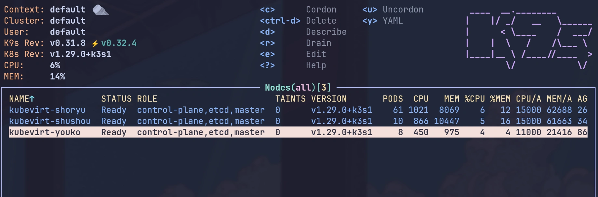
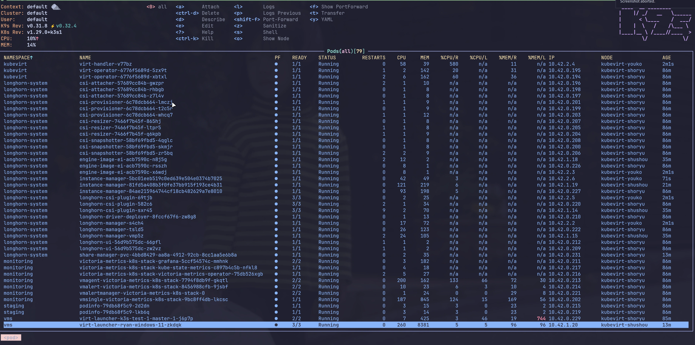

# Kubernetes Clusters

> WIP, not finished yet.

I'm running two Kubernetes clusters, one for production and one for testing.

I prefer to use [k3s] as the Kubernetes distribution, because it's lightweight, easy to install, and
full featured(see [what-have-k3s-removed-from-upstream-kubernetes] for details).

## KubeVirt Cluster

The KubeVirt cluster is running on physical machines, all my virtual machines are running on this
cluster, including other Kubernetes clusters.

## K3s Clusters

Clusters running as virtual machines on the KubeVirt cluster, for testing and production.

1. For production:
   1. `k3s-prod-1-master-1`
   1. `k3s-prod-1-master-2`
   1. `k3s-prod-1-master-3`
   1. `k3s-prod-1-worker-1`
   1. `k3s-prod-1-worker-2`
   1. `k3s-prod-1-worker-3`
1. For testing:.
   1. `k3s-test-1-master-1`
   2. `k3s-test-1-worker-1`
   3. `k3s-test-1-worker-2`
   4. `k3s-test-1-worker-3`

## Kubernetes Resources

Kubernetes resources are deployed and managed separately through
[ryan4yin/k8s-gitops](https://github.com/ryan4yin/k8s-gitops).

[k3s]: https://github.com/k3s-io/k3s/
[what-have-k3s-removed-from-upstream-kubernetes]:
  https://github.com/k3s-io/k3s/?tab=readme-ov-file#what-have-you-removed-from-upstream-kubernetes
