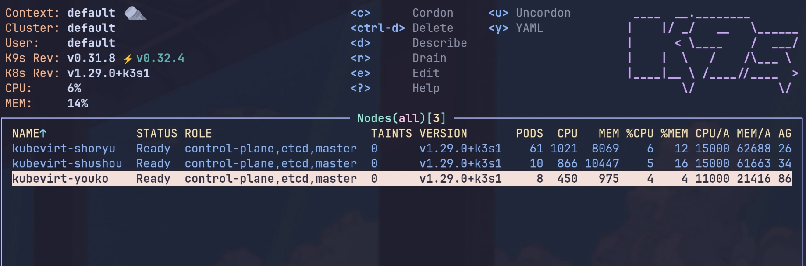
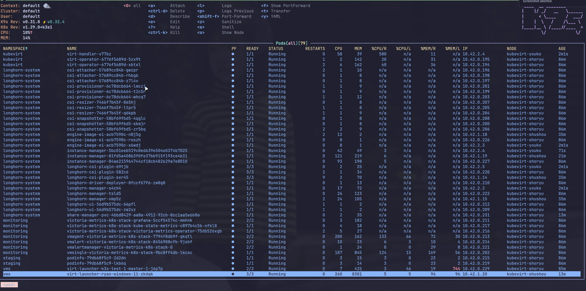

# Kubernetes Clusters

> WIP, not finished yet.

I'm running a Kubernetes cluster for testing and development.

I prefer to use [k3s] as the Kubernetes distribution, because it's lightweight, easy to install, and
full featured(see [what-have-k3s-removed-from-upstream-kubernetes] for details).

## KubeVirt Cluster

The KubeVirt cluster is running on physical machines, all my virtual machines are running on this
cluster, including other Kubernetes clusters.

## K3s Clusters

Clusters running as virtual machines on the KubeVirt cluster, for testing and development.

1. `k3s-test-1-master-1`
1. `k3s-test-1-master-2`
1. `k3s-test-1-master-3`
1. `k3s-test-1-worker-1`
1. `k3s-test-1-worker-2`
1. `k3s-test-1-worker-3`

## TODO / Known issues

- **The USB HDD bridge is flaky.** aquamarine's two HDDs sit behind a JMicron JMS567 USB-SATA bridge
  that keeps resetting (`dmesg` on `kubevirt-youko`). Find out how often it resets and how much it
  matters before putting anything critical (e.g. an NFS export) on it.
- **Move aquamarine out of KubeVirt.** It is a "core" machine, so it should not depend on the
  k8s/KubeVirt control plane; run it as a NixOS microVM on `kubevirt-youko` (`microvm.nix`) instead,
  reusing its current disk. Consider consolidating the NFS server onto it afterwards (with a fast
  and a slow tier).

## Kubernetes Resources

Kubernetes resources are deployed and managed separately through
[ryan4yin/k8s-gitops](https://github.com/ryan4yin/k8s-gitops).

[k3s]: https://github.com/k3s-io/k3s/
[what-have-k3s-removed-from-upstream-kubernetes]:
  https://github.com/k3s-io/k3s/?tab=readme-ov-file#what-have-you-removed-from-upstream-kubernetes
